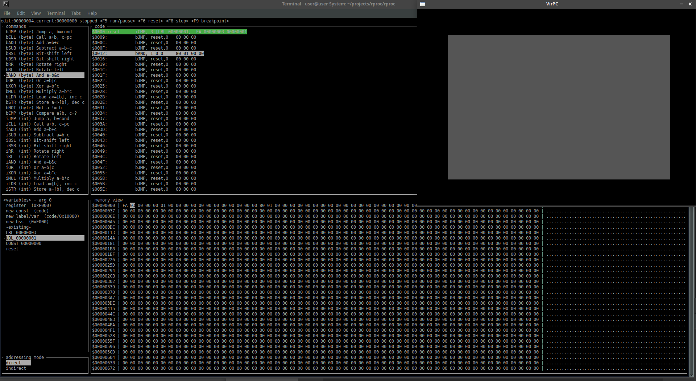

# rproc
A basic, transparent processor emulator for learning how processors and peripherals work, and 'easy' programming.  

This project aims to provide a very simple processor emulator, with a reduced instruction set of 32 instructions, 
and easy to understand hardware interfaces. For example, besides the program counter, all registers are memory mapped, 
all hardware such as video is directly memory mapped, and can be written to by adressing the right location.  

Aditionally, the emulator can be controlled from an ncurses based IDE, that attempts to provide insight and 
control over the processor-emulator, without a steep learning curve. It tries to provide full transparancy 
over the processor-instructions, mnemonics, subsequent opcodes, and the resulting actions in memory.  

The debuuger allows to step trough the code, and observe the actions in memory.  

This work has been derived from the kondrak/rust64 Commodore64 emulator that was written in rust.  
Many thanks to Kondrak for providing his code.  

The sceenshot below displays the interface, as well as the framebuffer that can be written to. Be advised though
it is still a work in progress.  

# Install

for minifb we need the following libraries, to prevent errors when building the library during the next step;  

`$ sudo apt install libxkbcommon-dev libwayland-cursor0 libwayland-dev`

after that we can do  

`$ cargo build` 

to build the project, and all should be well.  

# Run

`$ cargo run`

# Basic controls

Command line arguments:  
`debugger` - will open the debugger window of the emulator  
`file.prg` - will attempt to load this file as the current program  

Navigation within a window is done with the arrow keys, tab lets you switch windows, enter is used to confirm a selection.  
You can see <> on the title's (command, code, variables, addressing mode and memory view) to know your current window focus.  
The keys listed in the top row will control debugger and execution flow.  
The current address to be edited, is displayed in edit, and the current address to be executed is displayed in current.  
esc will quit the program  

## Workflow

1. You navigate to the line you'd like to edit in the code window, in the top-left screen  

2. then you choose the desired opcode, by switching to the commands window using tab, and pressing the up/down arrow, and press enter to confirm.  

3. Use tab to define the opcode's arguments, choosing from existing lables, constand values, registers or define a new constand, label/variable(stack) or bss(heap) variable.  
The address in memory of register(0xF000)/stack(var; 0x10000)/heap(bss; 0xE000) are listed behind the options.  
The left/right arrows let you select between opcode arguments (args 1,2 or 3 if available)  

4. choose if the data to be operated on is a value(direct) or a pointer(indirect), and press enter to confirm.(notice the opcode change when you press enter)  

5. tab to review the data in hex, and for easy manipulation of data, strings and such  
When in the hex-editor screen(bottom right), you can press e to edit values in memory,  
and edit values by first navigating with the arrows to the value you want to edit,  
and edit by typing the hex value(always in pairs of 2).  
Pressing f opens a menu to find labels(esc to cancel, enter to confirm)  
Use tab to switch from hex to ascii input, until you press esc.  

6. Use tab to move back to the code window, and select the next opcode.  

7. When the program is ready, press F5 to run the code, and use F6 for reset of the processor  
Use F8 for single stepping, and F9 for breakpoints  

